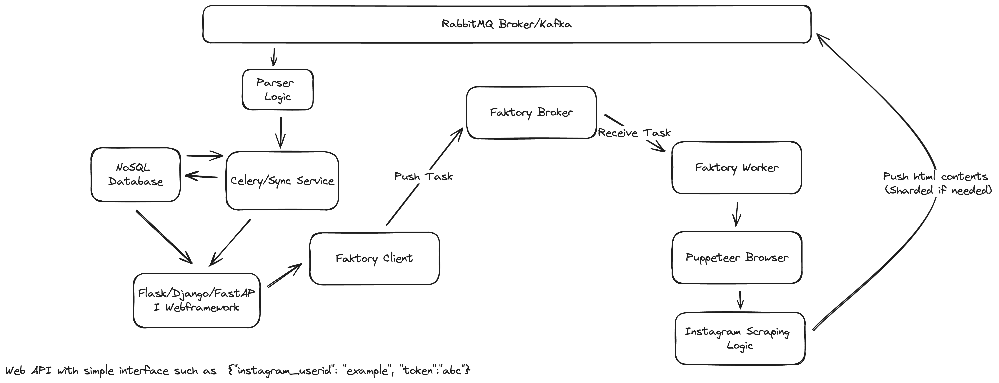

## What can be done better given enough time

1. Handle edge cases, i.e if a profile is private
2. Statistically calculated delay instead of guesses, maybe read config from database
3. Handle errors
4. Retry on error
5. Instead of using Faktory, use a better scalable components like Kafka/Kinesis(AWS Variant)
6. Right now a single instance of browser handles everything, this can be made scalable if we can start as many instances on demand
7. Use cookie persistency for efficient login
8. Graceful shutdown
9. Handle login so that the account doesn't get banned
10. Add caching layer and deduplicate mechanism

### Proposed Architecture 

